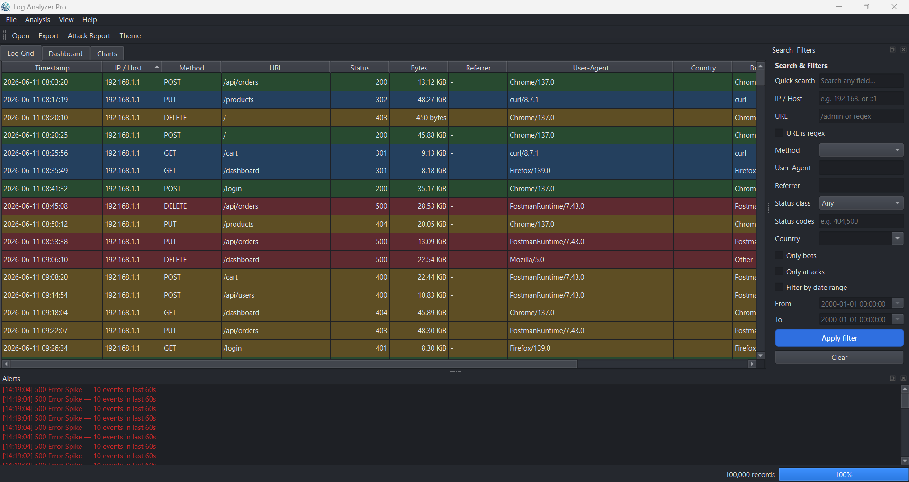
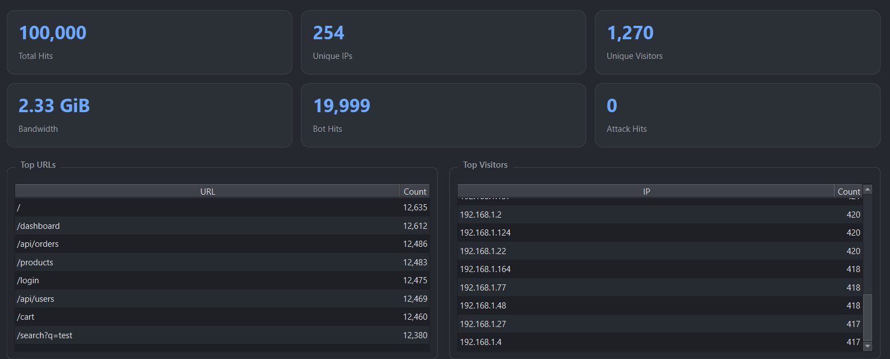
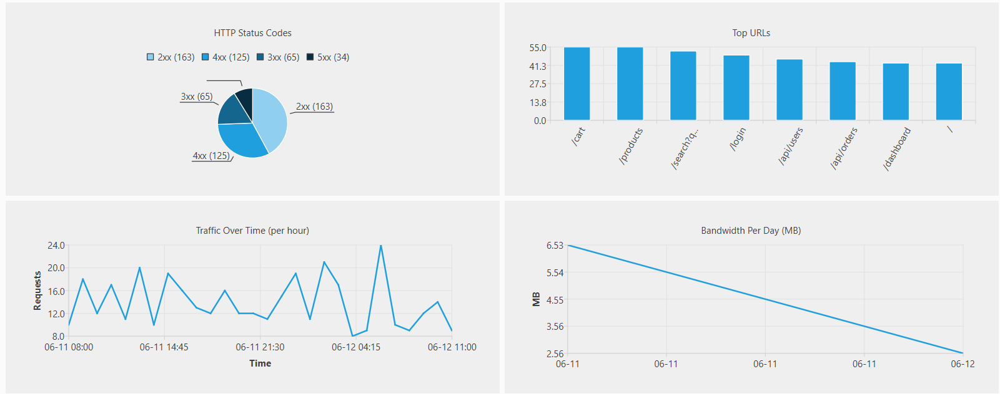
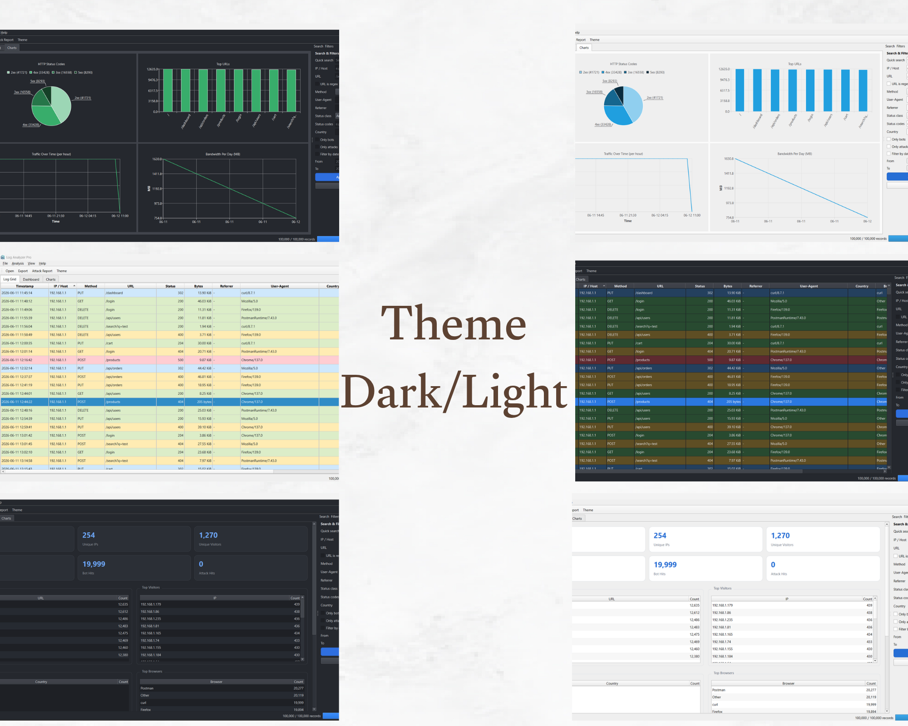

# Log Analyzer Pro
 
**A fast, native Windows desktop analyzer for web‑server logs — Apache · Nginx · IIS · Custom.**
by **Sohaib JadAllah**

## ✨ Overview
 
Log Analyzer Pro is a self‑contained native desktop tool that turns raw web‑server
logs into searchable, filterable insight — fully **offline**, no cloud, no telemetry.
It handles **multi‑gigabyte** files via streaming, multi‑threaded ingestion, and
ships a modern light/dark UI with dashboards, charts, and built‑in attack detection.
 
> Designed as a faster, blue‑team‑friendly alternative to classic log viewers.
## 📸 Screenshots
 
| Log Grid | Dashboard |
|----------|-----------|
|  |  |
 
| Charts | Dark mode |
|--------|-----------|
|  |  |
## 🚀 Features
 
- **Formats:** Apache (Common/Combined), Nginx, IIS W3C, Custom — with automatic format detection.
- **Inputs:** `.log` / `.txt` / `.gz`; open multiple files and merge; **Access** and **Error** logs; **Append** to current data; **Remote** logs over HTTP/HTTPS.
- **Fast data grid:** virtualized rendering, sortable, show/hide columns, status‑code coloring, IPv4 + IPv6, full‑text tooltips.
- **Search & filters:** by IP (boundary‑aware), URL, method, user‑agent, referrer, country, status, date range, bots/attacks, regex.
- **Statistics dashboard:** hits, unique visitors/IPs, bandwidth, top URLs/visitors/referrers/countries/browsers/OS, status breakdown, bot analysis.
- **Charts:** status pie, top‑URLs bar, traffic over time, bandwidth per day.
- **Security:** automatic bot detection and attack flagging (SQLi, XSS, directory traversal, command injection, scanners) plus brute‑force correlation.
- **Alerts:** 404/500 spikes, traffic anomalies, suspicious IPs.
- **Real‑time monitoring:** tail an active log with rotation handling.
- **Export:** CSV, JSON, HTML, PDF (XLSX optional).
- **GeoIP:** optional MaxMind GeoLite2 support.
- **Themes:** polished light & dark modes.

## 📥 Install (end users)
 
1. Go to **[Releases](../../releases/latest)** and download `LogAnalyzerPro-1.0.0-win64-setup.exe`.
2. Run the installer (creates Start‑menu and Desktop shortcuts).
3. Launch **Log Analyzer Pro**, then **File → Add Access Log…**.
No extra runtime is required — Qt, the MSVC runtime, and dependencies are bundled.
 
## 🛠 Build from source
 
**Requirements:** Qt 6.5+ (MSVC 64‑bit, incl. Qt Charts), Visual Studio 2022 (C++), CMake 3.21+, zlib, and NSIS (for the installer).

## 👤 Author
**Sohaib JadAllah** — cybersecurity / blue‑team & systems developer.
